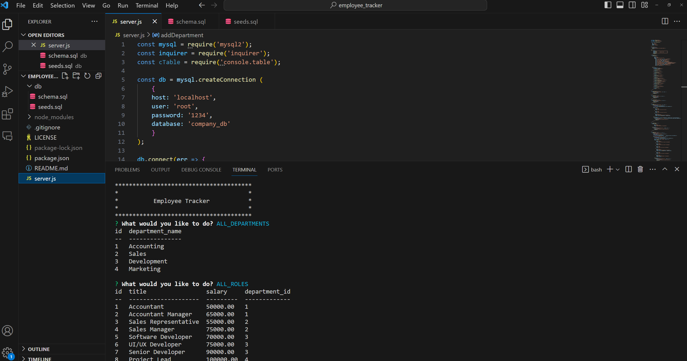

# employee_tracker
  by Jake Lipscomb
  

## Click the screenshot to watch my walkthrough video on YouTube!

  ## Table of Contents
  * [Description](#description)
  * [Requirements](#requirements)
  * [Usage](#usage)
  * [Contact-Info](#contact-info)
  * [Contributors](#contributors)
  * [Testing](#testing)
* [License](#license)

## Description
The purpose of this project was to create a database that can be used to track employees, their roles, and their departments. This application is run through the command line and uses MySQL to store and retrieve data. The user can add, view, update, and delete employees, roles, and departments. This application is useful for any business that needs to keep track of their employees, roles, and departments.
## Requirements
    inquirer: "^8.2.4",
    mysql2: "^2.2.5",
    "console.table": "^0.10.0"

## Usage
Node, JavaScript
## Contact-Info
* Username: jakelipscomb (https://github.com/jakelipscomb/)
* Email: jlipscombtx95@gmail.com
## Contributors
none
## Testing

To recreate this project, begin by cloning through:

    git clone https://github.com/jakelipscomb/employee_tracker.git

To install required packages, run in terminal:

    npm i

Log into MySQL and run the following commands:

    source db/schema.sql;
    source db/seeds.sql;

Quit MySQL

Run application with

    node server.js

or

    npm start

This will run the application locally within the `command line`.

## License
      This Project is using the MIT license.
